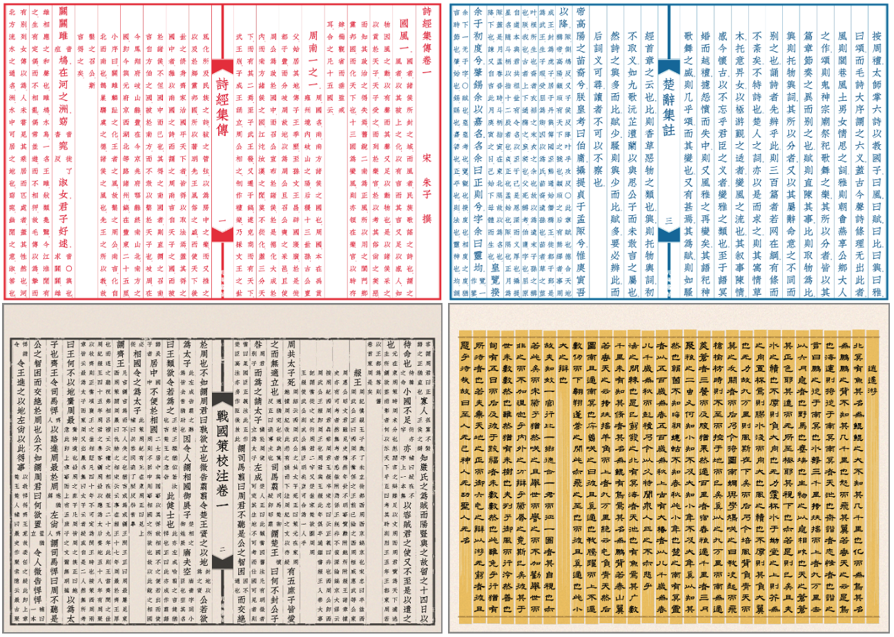
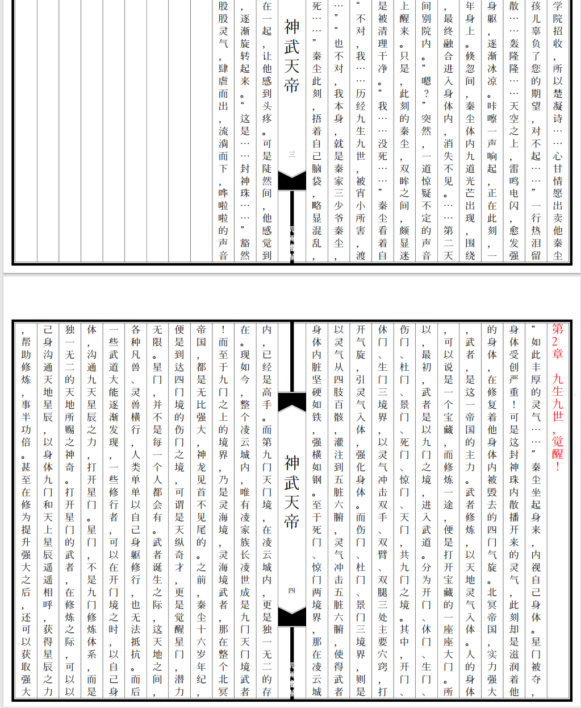

# vRain - 中文古籍刻本风格电子书制作工具

<div align="center">


**🎨 专业的中文古籍风格直排电子书制作工具**

[](https://www.python.org/)
[](LICENSE)
[]()

*传承古典，融汇现代*

[快速开始](#快速开始) • [功能特性](#功能特性) • [使用指南](#使用指南) • [API文档](#api文档) • [贡献指南](#贡献指南)

</div>

---

## 📖 项目简介

vRain 是一款专为中文古籍数字化设计的电子书制作工具，能够将普通文本转换为具有传统古籍刻本视觉效果的高质量PDF电子书。本项目采用现代Python技术栈重新实现，在保持原有Perl版本功能完整性的基础上，显著提升了跨平台兼容性、安装便捷性和用户体验。

### 🎯 设计理念

- **传承古典美学**：严格按照传统古籍刻本的排版规范和视觉风格
- **现代技术融合**：采用现代Python生态和GUI技术，提供优秀的用户体验
- **专业级品质**：支持多种字体混合排版、精确的版式控制和高质量PDF输出
- **灵活适配**：同时支持古籍连续排版和现代小说章节排版两种模式

---

## ✨ 功能特性

### 🎨 核心功能

| 功能分类 | 功能特性 | 说明 |
|---------|---------|------|
| **排版模式** | 古籍连续模式 | 传统古籍连续排版，无章节分隔 |
| | 小说章节模式 | 章节标题显示在第一列，内容从第二列开始 |
| **界面支持** | 现代化GUI界面 | 支持深色/浅色主题切换，响应式布局 |
| | 命令行工具 | 支持批处理和自动化脚本 |
| **排版控制** | 多字体混合排版 | 自动字体回退，支持生僻字处理 |
| | 精确版式控制 | 可配置行距、列距、页边距等参数 |
| | 背景图定制 | 多种古籍风格背景，支持自定义 |
| **高级功能** | PDF压缩优化 | 集成Ghostscript，输出体积优化 |
| | 简繁转换 | 智能简繁体转换和异体字处理 |
| | 批量处理 | 支持多文件批量生成 |

### 🖥️ 用户界面

#### 现代化双模式GUI
- **完美复刻模式**：基于原始算法的精确古籍排版
- **小说章节模式**：优化的章节排版，适合现代文学作品
- **主题系统**：深色/浅色主题无缝切换
- **实时反馈**：生成进度、日志输出、错误提示
- **响应式布局**：适配不同屏幕尺寸

#### 专业工具集成
- **字体检查工具**：检测字体对特殊字符的支持
- **字符替换工具**：批量处理不支持的字符
- **PDF压缩工具**：优化输出文件大小
- **背景生成工具**：自定义古籍风格背景

---

## 🚀 快速开始

### 系统要求

- **Python**: 3.8 或更高版本
- **操作系统**: Windows 10+、macOS 10.14+、Ubuntu 18.04+
- **内存**: 建议 4GB 以上
- **存储**: 至少 1GB 可用空间（含字体文件）

### 安装步骤

#### 1️⃣ 获取项目

```bash
# 克隆仓库
git clone https://github.com/msyloveldx/vRain-Python.git
cd vRain-Python

# 或下载发行版
wget https://github.com/msyloveldx/vRain-Python/archive/refs/heads/main.zip
unzip vRain-Python-main.zip && cd vRain-Python-main

# 或release下载
```

#### 2️⃣ 安装依赖

```bash
# 安装Python依赖
pip install -r requirements.txt
```

#### 3️⃣ 可选组件

**PDF压缩功能（推荐）**：

<details>
<summary>点击查看各平台安装方法</summary>

**Windows**:
```bash
# 下载并安装 Ghostscript
# https://www.ghostscript.com/download/gsdnld.html
# 确保 gs.exe 在系统 PATH 中
```

**macOS**:
```bash
brew install ghostscript
```

**Ubuntu/Debian**:
```bash
sudo apt-get update
sudo apt-get install ghostscript
```

**CentOS/RHEL**:
```bash
sudo yum install ghostscript
```

</details>

#### 4️⃣ 验证安装

```bash
# 检查依赖
python -c "import reportlab, PIL; print('依赖检查通过')"

# 运行测试
python vrain.py -h
```

---

## 📚 使用指南

### 🖥️ 图形界面版本（推荐）

#### 现代化双模式GUI

启动现代化双模式GUI：

```bash
# 启动现代化GUI（同时支持两种模式）
python gui.py

# 直接双击gui.exe启动
```

**GUI功能特色**：
- 🎨 现代化界面设计，支持主题切换
- 📖 双模式支持：完美复刻模式 + 小说章节模式
- ⚡ 实时预览和进度显示
- 🛠️ 集成专业工具（字体检查、字符替换等）
- 📱 响应式布局，适配不同屏幕尺寸



#### 传统GUI版本

**单文件模式GUI**：
```bash
# 基于 vrain.py 的传统GUI
python vrain.py
```


### ⌨️ 命令行版本

#### 完美复刻模式（vrain.py）

基于原始Perl算法的精确古籍排版：

```bash
# 基本用法
python vrain.py

# 指定第1书本到第2书本的排版结果
python vrain.py -b -f 1 -t 2

# 测试模式（仅生成前5页）
python vrain.py -b -f 1 -t 1 -z 5

# 启用PDF压缩
python vrain.py -b -f 1 -t 1 -c

# 详细输出
python vrain.py -b -f 1 -t 1 -v
```

#### 小说章节模式（vrainNovel.py）

专为现代文学作品设计的章节排版：

```bash
# 小说章节模式
python vrainNovel.py

# 指定章节范围
python vrainNovel.py --from-chapter 1 --to-chapter 5

# 自动章节检测
python vrainNovel.py --auto-detect
```

### 📋 排版模式对比

| 特性 | 完美复刻模式 | 小说章节模式 |
|------|-------------|-------------|
| **适用场景** | 古籍、诗词、散文 | 现代小说、网络文学 |
| **排版风格** | 连续直排，古法排版 | 章节分隔，现代化布局 |
| **章节处理** | 不区分章节 | 自动识别章节标题 |
| **标题显示** | 与正文统一字号 | 章节标题突出显示 |
| **页面布局** | 传统古籍布局 | 优化的阅读体验 |

### 📝 文本格式要求

#### 古籍连续模式
```
文本连续排列，无特殊格式要求
支持标点符号自动处理
自动繁简转换（可选）
```

#### 小说章节模式
```
第一章 章节标题
章节内容开始...

第二章 另一个章节
更多内容...
```

---

## ⚙️ 配置详解

### 📄 书籍配置文件 (book.cfg)

vRain使用INI格式的配置文件控制排版参数：

```ini
# 基础信息
title=史记
author=司马迁
canvas_id=01_Black

# 排版参数
row_num=25              # 每列字数
enable_chapter_mode=0   # 章节模式开关（0=古籍模式，1=章节模式）

# 字体配置
font1=SourceHanSerifSC-Regular.otf
font2=HanaMinA.ttf
font3=HanaMinB.ttf

# 高级参数
text_font1_size=32
line_spacing=1.2
page_margin_top=80
```

### 🎨 背景图配置

背景图配置文件定义了页面的视觉风格：

```ini
# 画布尺寸
canvas_width=2480
canvas_height=1860

# 页边距
margins_top=126
margins_bottom=126
margins_left=126
margins_right=126

# 列布局
leaf_col=24
```

**预设风格**：
- `01_Black`: 经典黑色边框
- `01_Blue`: 典雅蓝色主题  
- `01_Red`: 传统红色配色
- `28_Black`: 28列密集排版
- `simple`: 简约现代风格

---

## 🔧 工具脚本

### 字体检查工具

检测字体对文本的支持情况：

```bash
cd books/01
python ../../tools/fontcheck.py -f 1 -t 5

# 生成字体支持报告
python ../../tools/fontcheck.py --report
```

### 字符替换工具

处理不支持的字符：

```bash
cd books/01
python ../../tools/chareplace.py -b 01 -f 1 -t 5

# 批量替换模式
python ../../tools/chareplace.py --batch --replace-file custom_replace.txt
```

### PDF压缩工具

优化输出文件大小：

```bash
# 压缩单个PDF
python tools/pdfcompress.py input.pdf output.pdf

# 批量压缩
python tools/pdfcompress.py -d ./pdf --quality medium
```

### 背景图生成工具

生成自定义背景图：

```bash
cd canvas
python canvas.py -c 01_Black

# 批量生成所有风格
python canvas.py --generate-all
```

---

## 📁 项目结构

```
vRain/
├── 📁 主程序模块
│   ├── vrain.py              # 完美复刻模式（基于原始算法）
│   ├── vrainNovel.py         # 小说章节模式（优化排版）
│   └── gui.py                # 现代化双模式GUI
├── 📁 书籍内容 (books/)
│   ├── 01/                   # 史记（古籍连续模式示例）
│   ├── 02/                   # 其他古籍
│   ├── 03/                   # 诗词集
│   └── 04/                   # 神武天帝（小说章节模式示例）
├── 📁 背景资源 (canvas/)
│   ├── *.cfg                 # 背景配置文件
│   ├── *.jpg                 # 生成的背景图
│   └── canvas.py             # 背景生成器
├── 📁 专业工具 (tools/)
│   ├── fontcheck.py          # 字体检查
│   ├── chareplace.py         # 字符替换
│   ├── pdfcompress.py        # PDF压缩
│   └── insertimg.py          # 图片插入
├── 📁 字体库 (fonts/)
│   └── *.ttf, *.otf          # 中文字体文件
├── 📁 数据库 (db/)
│   └── num2zh_jid.txt        # 数字转中文映射
├── 📁 示例图片 (images/)
│   └── *.png                 # 功能展示图片
└── 📁 输出目录 (results/)
    └── *.pdf                 # 生成的PDF文件
```

---

## 📊 使用示例

### 古籍排版示例

**史记排版**（连续模式）：


**配置文件**：
```ini
title=史记·本纪第一
author=汉·司马迁
canvas_id=01_Black
row_num=25
enable_chapter_mode=0
font1=SourceHanSerifSC-Regular.otf
```

### 小说排版示例

**现代小说排版**（章节模式）：


**配置文件**：
```ini
title=神武天帝
author=网络作家
canvas_id=01_Blue
row_num=30
enable_chapter_mode=1
font1=XiaolaiMonoSC-Regular.ttf
```

---

## 🔍 常见问题

<details>
<summary><strong>Q: 如何添加新字体？</strong></summary>

1. 将TTF/OTF字体文件放入 `fonts/` 目录
2. 在 `book.cfg` 中配置字体：
   ```ini
   font1=新字体文件名.ttf
   ```
3. 使用字体检查工具验证支持情况

</details>

<details>
<summary><strong>Q: 字体显示异常怎么办？</strong></summary>

1. 运行字体检查工具：
   ```bash
   python tools/fontcheck.py -f 1 -t 1
   ```
2. 查看生成的 `replace.tmp` 文件
3. 编辑 `replace.txt` 文件进行字符替换
4. 重新生成PDF

</details>

<details>
<summary><strong>Q: PDF压缩失败怎么办？</strong></summary>

确保已正确安装Ghostscript：
- Windows: 下载安装包并添加到PATH
- macOS: `brew install ghostscript`
- Linux: 使用包管理器安装

测试安装：
```bash
gs --version
```

</details>

<details>
<summary><strong>Q: 如何选择排版模式？</strong></summary>

**古籍连续模式** (enable_chapter_mode=0)：
- 适合：古籍、诗词、散文、连续文本
- 特点：传统直排，无章节分隔

**小说章节模式** (enable_chapter_mode=1)：
- 适合：现代小说、网络文学、有明确章节的文本
- 特点：章节标题突出，内容分页

</details>

<details>
<summary><strong>Q: GUI无法启动怎么办？</strong></summary>

1. 检查Python版本（需要3.8+）：
   ```bash
   python --version
   ```
2. 安装依赖：
   ```bash
   pip install -r requirements.txt
   ```
3. 检查tkinter支持：
   ```bash
   python -c "import tkinter; print('GUI支持正常')"
   ```

</details>

---

## 🚀 高级用法

### 批量处理

批量生成多本书籍：

```bash
# 使用shell脚本批量处理
for book in books/*/; do
    cd "$book"
    python ../../vrain.py
    cd ../..
done
```

### 自定义样式

创建自定义背景样式：

```bash
# 复制现有配置
cp canvas/01_Black.cfg canvas/my_style.cfg

# 编辑配置参数
# 生成新背景
cd canvas
python canvas.py -c my_style
```

### API集成

在Python脚本中使用vRain：

```python
from pathlib import Path
from vrain import VRainPerfect
from vrainNovel import VRainPDFGenerator

# 古籍模式
generator = VRainPerfect()
generator.run()

# 小说模式
text_file = Path('books/04/text/神武天帝.txt')
book_cfg = Path('books/04/book.cfg')
novel_generator = VRainPDFGenerator(text_file, book_cfg)
novel_generator.generate_pdf(text_file)
```

---

## 🔧 开发指南

### 开发环境搭建

```bash
# 克隆开发版本
git clone https://github.com/msyloveldx/vRain-Python.git
cd vRain-Python

# 创建虚拟环境
python -m venv venv
source venv/bin/activate  # Linux/Mac
# venv\Scripts\activate    # Windows

# 安装开发依赖
pip install -r requirements-dev.txt
```

### 代码规范

项目遵循以下代码规范：
- **PEP 8**: Python代码风格指南
- **Type Hints**: 使用类型注解
- **Docstring**: Google风格文档字符串

```python
def generate_pdf(self, text_file: Path, 
                output_path: Optional[Path] = None) -> bool:
    """生成PDF文件
    
    Args:
        text_file: 输入文本文件路径
        output_path: 输出PDF路径，默认为None
        
    Returns:
        生成成功返回True，失败返回False
        
    Raises:
        FileNotFoundError: 当文本文件不存在时
    """
    pass
```

### 测试

运行测试套件：

```bash
# 运行所有测试
python -m pytest

# 运行特定测试
python -m pytest tests/test_vrain.py

# 生成覆盖率报告
python -m pytest --cov=vrain
```

---

## 🤝 贡献指南

我们欢迎所有形式的贡献！请参考以下指南：

### 贡献类型

- 🐛 **错误修复**：修复现有问题
- ✨ **新功能**：添加新的功能特性
- 📚 **文档改进**：完善文档和示例
- 🎨 **界面优化**：改进用户界面和体验
- ⚡ **性能优化**：提升代码性能

### 贡献流程

1. **Fork项目**并创建功能分支
2. **编写代码**并添加测试
3. **确保测试通过**并符合代码规范
4. **提交Pull Request**并描述改动

```bash
# 1. Fork并克隆
git clone https://github.com/msyloveldx/vRain-Python.git
cd vRain-Python

# 2. 创建功能分支
git checkout -b main/your-feature-name

# 3. 提交改动
git add .
git commit -m "feat: 添加新功能描述"

# 4. 推送并创建PR
git push origin main/your-feature-name
```

### 开发规范

- 遵循现有代码风格
- 添加必要的测试用例
- 更新相关文档
- 提供清晰的提交信息

---

## 📄 许可证

本项目采用 [MIT License](LICENSE) 开源协议。

---

## 🙏 致谢

- **原作者**: [shanleiguang](https://github.com/shanleiguang) - 原始Perl版本的开发者
- **Python移植**: [msyloveldx](https://github.com/msyloveldx) - Python版本的主要开发者
- **社区贡献者**: 所有为项目做出贡献的开发者和用户
- **古籍数字化先驱**: 致敬所有为古籍保护和传承做出努力的学者专家

特别感谢中文古籍数字化社区的支持和反馈！

---

## 📞 联系方式

- **项目主页**: https://github.com/msyloveldx
- **问题报告**: [GitHub Issues](https://github.com/msyloveldx/vRain-Python/issues)
- **功能建议**: [GitHub Discussions](https://github.com/msyloveldx/vRain-Python/discussions)
- **邮件联系**: 2195357023@qq.com

---

<div align="center">

**如果这个项目对你有帮助，请给它一个 ⭐**

*传承古典文化，拥抱现代技术*

[⬆ 返回顶部](#vrain---中文古籍刻本风格电子书制作工具)

</div>